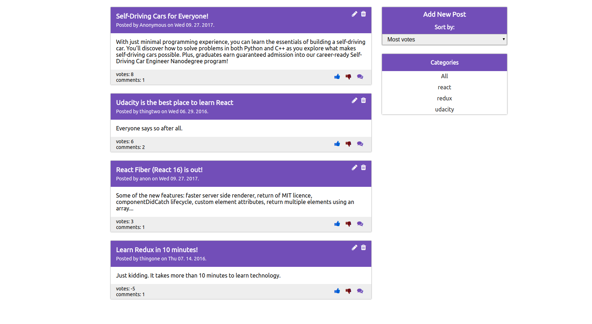
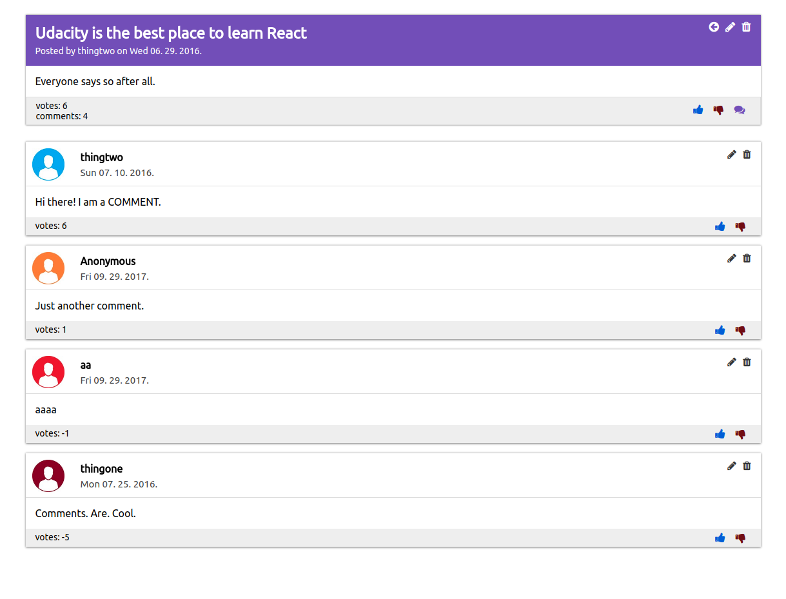

# Readable

## Project description

This application is created for the purpose of completing 2nd project of [Udacity](https://www.udacity.com/)'s [React Nanodegree](https://www.udacity.com/course/react-nanodegree--nd019).
The goal was to build a content and comment web app. Users are able to post content to predefined categories, comment on their posts and other users' posts, and vote on posts and comments. Users are also able to edit and delete posts and comments.

Our task was to build only the front-end of this application. The [local backend api-server](https://github.com/udacity/reactnd-project-readable-starter) was already provided by Udacity. The server is very simple, it doesn't contain any mechanism for authentication or
storing data permanently. It's only purpose is to provide necessary API endpoints for the
front-end application.

##### Note:
This project had a specific requirement to use only Redux to manage the application state. This includes all user actions and responses from the API server. We were allowed to use React component state to handle form input fields and controlled components. Otherwise, the rest of the state for the application is controlled by Redux.

## Installing application dependencies

In order to successfully install dependencies and run the application, it is required to have Node.js and npm installed. Further instructions for downloading and installing Node can be found on [official Node website](https://nodejs.org/en/).

##### Installing front-end dependencies

After cloning or downloading the repository:

`$ cd Readable-React-Redux/client`

`$ npm install`

##### Installing api-server dependencies

`$ cd Readable-React-Redux/api-server`

`$ npm install`

## Running the application

The api-server and the React application will run on two separate ports on your local machine.
Therefore, they should be started separately.

`$ cd Readable-React-Redux/client`

`$ npm start` - will start the React app on `localhost:3000`

Open another terminal window:

`$ cd Readable-React-Redux/api-server`

`$ npm start` - will start the api-server on `localhost:3001`

##### Concurrently run api-server and React application

Another option is to run both servers with just one command instead of opening two terminal windows. While developing this application, I have used an NPM package named `concurrently` to achieve this.

`$ cd Readable-React-Redux`

`$ npm install` - will install `concurrently` from dependencies specified in Readable-React-Redux/package.json

`$ npm start` - will run both servers at the same time

